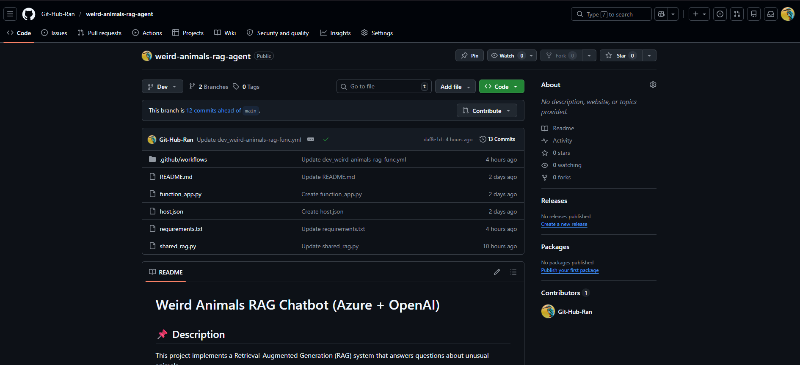

# 🐾 Weird Animals RAG API (Azure + OpenAI)

## 📌 Description

This project implements a Retrieval-Augmented Generation (RAG) system that answers questions about unusual animals.

It retrieves relevant document chunks using semantic search and generates grounded answers using Azure OpenAI.

The system ensures that answers are based only on the provided data and avoids hallucinations.

---

## ⚠️ Project Status

**The live API has been taken down** to avoid ongoing Azure costs.
The project is fully functional and can be redeployed at any time using the code and GitHub Actions workflow in this repo.

📺 A full demo video is available below, showing the API in action.

---

## 🎥 Demo Video

A short technical walkthrough of the project - architecture, design decisions, and live demo.

▶️ **[Watch the demo](https://github.com/Git-Hub-Ran/rag-api-azure/releases/tag/v1.0-demo)**

---

## 🧠 Architecture

User → HTTP Request → Azure Function → Vector Search → LLM → JSON Response

The system uses lazy initialization to avoid repeated heavy processing and improve performance.

---

## 📂 Project Structure

* `shared_rag.py`
  Contains the core RAG logic:

  * Loads documents from Azure Blob Storage
  * Splits them into chunks
  * Creates embeddings using Azure OpenAI
  * Stores vectors in Chroma
  * Implements the `ask_question` function

* `function_app.py`
  Defines the HTTP API using Azure Functions
  Receives a question and returns an answer with sources

* `requirements.txt`
  Lists all dependencies required to run the project

* `host.json`
  Configuration file for Azure Functions runtime

---

## 🔗 API (Previously Deployed)

The API was deployed to Azure Functions at:

POST https://weird-animals-rag-func-gfa3fgbqg7bcabd6.westeurope-01.azurewebsites.net/api/ask

> ⚠️ This endpoint is no longer active, the Azure resources were deleted to save on costs.
> You can watch the demo video above to see the API in action, or redeploy it yourself using the GitHub Actions workflow.

### Example request

```json
{
  "question": "Which animal can regenerate body parts?"
}
```

### How to test (when redeployed)

1. Deploy the function to your own Azure Functions instance
2. Go to https://hoppscotch.io
3. Select POST
4. Paste your deployed URL
5. Go to Body → JSON
6. Paste the example request
7. Click Send

---

## 🔐 Required Environment Variables

To run the function, set these in Azure Function App Configuration:

* `AZURE_STORAGE_CONNECTION_STRING` — connection string for your Blob Storage account
* `AZURE_OPENAI_ENDPOINT` — your Azure OpenAI resource endpoint
* `AZURE_OPENAI_API_KEY` — your Azure OpenAI API key

---

## 🧪 Example Questions

You can test the system with the following questions:

* Which animal can regenerate body parts?
* Which animal is considered biologically immortal?
* What makes the axolotl unique?
* How does the immortal jellyfish avoid death?

The documents include information about unusual animals such as the axolotl and the immortal jellyfish.

---

## 🚀 API Usage

### Endpoint

POST /api/ask

### Request

```json
{
  "question": "Which animal can regenerate body parts?"
}
```

### Response

```json
{
  "answer": "Based on the provided information...",
  "sources": ["axolotl.md"]
}
```

---

## 🧠 Guardrails Example

```json
{
  "question": "Where is Amsterdam?"
}
```

Response:

```json
{
  "answer": "I don't know.",
  "sources": []
}
```

---

## 📸 Screenshots

### ✅ Successful API Response


### ❓ Unknown Question (Guardrail)


### 🚀 Deployment Success


### 📂 GitHub Repository



---

## ⚙️ Tech Stack

* Azure Functions (Python)
* Azure Blob Storage
* Azure OpenAI
* LangChain
* ChromaDB
* GitHub Actions

---

## 🛠️ Deployment

The project used a fully automated CI/CD pipeline:

* Code pushed to the `Dev` branch
* GitHub Actions builds and deploys to Azure Functions
* Running on Azure Functions Flex Consumption plan (scales to zero)

To redeploy: clone the repo, set the required environment variables in Azure, and push to `Dev`.

---

## ⚠️ Notes

* The system only answers based on retrieved documents
* If the answer is not found in the data, it returns: "I don't know"

---

## 🎯 Purpose

This project demonstrates:

* Retrieval-Augmented Generation (RAG)
* Semantic search using vector databases
* Integration between Azure services and LLMs
* Building a production-style AI API
